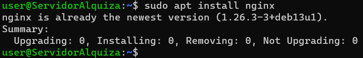
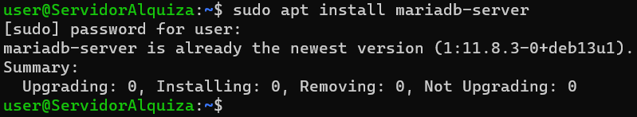
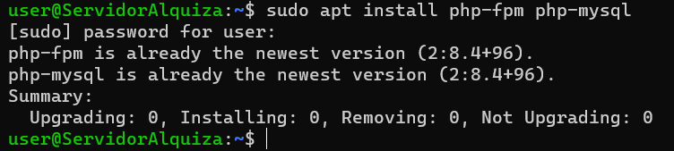
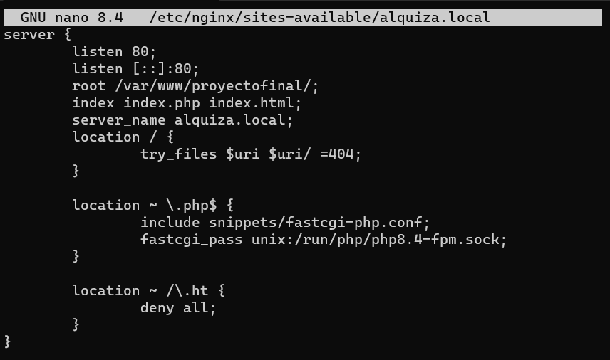

# Alquiza - Plataforma de Alquiler de Vehículos

**Proyecto Final - Desarrollo de Aplicaciones Web**

## Prototipo de la Página Web del Proyecto
**Autores:** Oier Bárcena, Illart Beain, Unax Vizcaíno, Marina Redondo

---

**Alquiza** es una plataforma web completa para la gestión y alquiler de vehículos (coches, motos y furgonetas). El sistema permite a los usuarios registrarse, buscar vehículos disponibles, realizar reservas y gestionar su perfil fácilmente. Los administradores tienen acceso a un panel de control para la gestión de vehículos, usuarios, sucursales y alquileres.

## Tecnologías Utilizadas

**Desarrollo localmente:**

- Xampp
- PHP
- Html, CSS, Bootstrap 5 y SASS
- JavaScript
- MySQL
- GitHub

**Para desplegarlo:**

- Debian Nginx
- Permisos de todo
- HTTPS
- MariaDB


## Instalación

### Primero: Instalar Localmente XAMPP


1. **Descargar e instalar XAMPP**
2. **Clonar el repositorio**
    ```bash
    cd C:\xampp\htdocs
    git clone <https://github.com/marredon9/Proyecto-final.git> Proyecto-final
    ```
3. **Configurar la base de datos**
    - Primero hacer la base de datos en MySQL.
    - Hacer un bd.sql con las tablas.
    - Configurar la conexión de la base de datos.
4. **Proyecto**
    - Hacer todo el trabajo PHP, js, etc...


### Segundo: Instalación Debian

**Pasos resumidos:**

1. **Actualizar el sistema**
    ```bash
    sudo apt update && sudo apt upgrade -y
    ```
2. **Configurar Apache**
3. **Clonar el repositorio**
    ```bash
    cd /var/www/html
    sudo git clone <URL_DEL_REPOSITORIO> alquiza
    sudo chown -R www-data:www-data alquiza
    ```
4. **Configurar MySQL**

---


## Configuración

La configuración del proyecto así la hemos hecho:


### Configuración de Base de Datos

```php
<?php

mysqli_report(MYSQLI_REPORT_ERROR | MYSQLI_REPORT_STRICT);

try {
    $host = "192.168.72.54";
    //$host = "192.168.0.180";
    //$host = "localhost";
    $user = "root";
    $pass = "root";
    $db = "alquiler";

    $cn = new mysqli($host, $user, $pass, $db);
    $cn->set_charset("utf8mb4");
} catch (mysqli_sql_exception $e) {
    echo $e->getMessage();
}

const DB_EMISIONES = [
    "NINGUNO",
    "0",
    "ECO",
    "B",
    "C"
];

const DB_MODOS = [
    "AUTOMATICO",
    "MANUAL"
];

const DB_TIPOS = [
    "COCHE",
    "MOTO",
    "FURGONETA"
];

?>
```


### Configuración de PHPs
Planeamos hacer el Frontend Marina, Illart y Oier, y el Backend Unax.

    Saber que hace cada PHP para dividirlos en:
    -Frontend
        -Index, Iniciar Sesion, Registrar ...
    -Backend
        -AlquilarCoche, BorrarAlquiler ...


### Configuración de SASS
Primero hicimos todo en CSS pero al final lo cambiamos a SASS para mejor funcionamiento a la larga.

    Carpeta con los SASS:
    -_variables.scss -Define colores globales
    -_navbar.scss -menú superior
    -_footer.scss -pie página
    -_hero.scss -banner principal
    -_cards.scss -tarjetas vehículos
    -_form.scss -formularios Iniciar Sesion y Registrarse
    -_buttons.scss -todos los botones
    -_section.scss -secciones generales
    -_faq.scss -preguntas frecuentes
    -main-light.scss -tema claro(cookie)
    -main-dark.scss -tema oscuro(cookie)


### Configuración de JavaScript
El JavaScript se iba añadiendo mediante cada uno que iba añadiendo su parte del código.
Hemos hecho solo un archivo de JavaScript y si era poco código abajo del PHP lo hemos añadido.

Archivos JS:
- script.js

---


## Ejecución

### Modo Desarrollo (Local)

1. Iniciar XAMPP Control Panel
2. Arrancar Apache y MySQL
3. Abrir navegador: http://localhost/Proyecto-final/Alquiza/index.php


### Modo Producción (Debian)

1. Verificar que Apache y MySQL estén ejecutándose:
   ```
   sudo systemctl status apache
   sudo systemctl status MySQL
   ```

2. Acceder vía HTTPS: https://alquiza.com


3. Iniciar toda la pagina
---


## Usuarios de Prueba

### Cuenta de Administrador

- **DNI:** "79124257W"
- **Email:** "24dw.marina.redondo@arangoya.net"
- **Contraseña:** "15e2b0d3c33891ebb0f1ef609ec419420c20e320ce94c65fbc8c3312448eb225"
- **Rol:** Administrador completo
- **Permisos:** 
  - Gestión de usuarios
  - Gestión de vehículos
  - Gestión de alquileres
  - Gestion de sucursales


### Cuentas de Usuario Regular

- **DNI:** "12345678J"
- **Email:** "24dw.illart.beain@arangoya.net"
- **Contraseña:** "4922b0b6b574d124524e3b81b56dae2c5fca36624b053d6d7e8d4fee6a7f1201"
- **Rol:** Usuario regular

---


## Estructura de Carpetas

Luego img separado por otra carpeta, archivo de JS separado suelto porque es uno y la carpeta de admin con su index separado porque ahí se hace todo de añadir coches, eliminar, etc...

### Estructura actual de carpetas

```
Proyecto_Final/
│
├── alquilarCoche.php
├── coche.php
├── furgoneta.php
├── contacto.php
├── GraciasAlquiler.php
├── include.php
├── index.php
├── IniciarSesion.php
├── PerfilUsuario.php
├── README.md
├── Registrarse.php
├── reservar.php
├── schema.sql
├── script.js
├── vehiculosUsuarios.php
│
├── admin/
│   ├── añadirSucursal.php
│   ├── añadirVehiculo.php
│   ├── include.php
│   ├── index.php
│   ├── sucursales.php
│   ├── usuarios.php
│   ├── vehiculos.php
│   ├── verSucursal.php
│   ├── verUsuario.php
│   └── verVehiculo.php
│
├── Alquiza/
│
├── api/
│   ├── buscar.php
│   └── include.php
│
├── assets/
│   │   ├── cerca.png  
│   │   ├── citroen.png  
│   │   ├── coche.png  
│   │   ├── descapotable.png  
│   │   ├── enchufe.png  
│   │   ├── escaparate.png  
│   │   ├── focus-2.png  
│   │   ├── furgoneta1.png  
│   │   ├── furgoneta2.png  
│   │   ├── furgoneta3.png  
│   │   ├── furgoneta4.png  
│   │   ├── grupo.png  
│   │   ├── ibiza.avif  
│   │   ├── maleta.png  
│   │   ├── marchas.png  
│   │   ├── moto.png  
│   │   ├── moto1.png  
│   │   ├── moto2.png  
│   │   ├── output.jpg  
│   │   ├── peugeot.png  
│   │   └── van.png  
│   └── vid/
        └── olas.mp4 
│
├── Documentacion/  
│   │   ├── ConfiguracionNginx.png  
│   │   ├── Diagrama_Flujo_Alquiza.drawio.png  
│   │   ├── EntidadRelacion.png  
│   │   ├── image.jpg  
│   │   ├── InstalacionPHP.png  
│   │   └── MariaDB.png 
│
├── include/
│   ├── cardBusquedaCoche.php
│   ├── db.php
│   ├── debug.php
│   ├── elementosComunes.php
│   ├── footer.php
│   ├── navbar.php
│   ├── rutas.php
│   └── sesionUsuario.php
│
├── info/
│   ├── include.php
│   ├── Informacion_legal.php
│   ├── MencionesLegales.php
│   ├── NuestrasSucursales.php
│   ├── PoliticaCookies.php
│   ├── PoliticaPrivacidad.php
│   ├── PoliticasDaños.php
│   ├── PoliticasDeposito.php
│   ├── PreguntasFrecuentes.php
│   ├── SitesMaps.php
│   └── TerminosCondiciones.php
│
├── sass/
│   ├── _admin.scss
│   ├── _buttons.scss
│   ├── _cards.scss
│   ├── _faq.scss
│   ├── _footer.scss
│   ├── _form.scss
│   ├── _hero.scss
│   ├── _navbar.scss
│   ├── _section.scss
│   ├── _table.scss
│   ├── _variables.scss
│   ├── main-dark.css
│   ├── main-dark.scss
│   ├── main-light.css
│   └── main-light.scss
│
├── servlets/
│   ├── alquilarCoche.php
│   ├── cerrarSesion.php
│   ├── include.php
│   ├── iniciarSesion.php
│   ├── registrarUsuario.php
│   └── admin/
│       ├── añadirSucursal.php
│       ├── añadirVehiculo.php
│       ├── editarSucursal.php
│       ├── editarUsuario.php
│       ├── editarVehiculo.php
        ├── exportarUsuariosCSV.php
│       └── include.php
```

---


## Base de Datos

### Esquema de Base de Datos

La base de datos `alquiza` consta de las siguientes tablas:

#### Tabla: `usuario`
Almacena información de usuarios registrados (clientes y administradores).

| Campo | Tipo | Descripción |
|-------|------|-------------|
| id | INT (PK, AI) | ID único del usuario |
| nombre | VARCHAR(128) | Nombre del usuario |
| apellido1 | VARCHAR(128) | Primer apellido |
| apellido2 | VARCHAR(128) | Segundo apellido (opcional) |
| dni | VARCHAR(16) | DNI único |
| email | VARCHAR(128) | Email único |
| contraseña | VARCHAR(64) | Contraseña hasheada |
| fecha_nac | DATE | Fecha de nacimiento |
| es_admin | BOOLEAN | Indica si es administrador |
| desactivado | BOOLEAN | Indica si la cuenta está desactivada |

#### Tabla: `sucursal`
Almacena información de las sucursales de alquiler.

| Campo | Tipo | Descripción |
|-------|------|-------------|
| id | INT (PK, AI) | ID único de la sucursal |
| nombre | VARCHAR(128) | Nombre de la sucursal |
| direccion | VARCHAR(256) | Dirección completa |
| latitud | FLOAT | Coordenada de latitud |
| longitud | FLOAT | Coordenada de longitud |
| telefono | NUMERIC(16) | Teléfono de contacto |

#### Tabla: `marca`
Almacena las marcas de vehículos.

| Campo | Tipo | Descripción |
|-------|------|-------------|
| id | INT (PK, AI) | ID único de la marca |
| nombre | VARCHAR(64) | Nombre de la marca |
| ruta_img | VARCHAR(1024) | Ruta de la imagen del logo |

#### Tabla: `modelo`
Almacena los modelos de vehículos.

| Campo | Tipo | Descripción |
|-------|------|-------------|
| id | INT (PK, AI) | ID único del modelo |
| id_marca | INT (FK) | Referencia a la marca |
| potencia | NUMERIC(3) | Potencia en CV |
| asientos | NUMERIC(2) | Número de asientos |
| puertas | NUMERIC(2) | Número de puertas |
| maletero | BOOLEAN | Tiene maletero |
| traccion | VARCHAR(16) | Tipo de tracción |
| modo | VARCHAR(16) | Manual o automático |
| extras | VARCHAR(128) | Extras incluidos |

#### Tabla: `vehiculo`
Almacena información de cada vehículo individual.

| Campo | Tipo | Descripción |
|-------|------|-------------|
| id | INT (PK, AI) | ID único del vehículo |
| matricula | VARCHAR(16) | Matrícula única |
| estado | VARCHAR(32) | Estado actual (disponible, alquilado) |
| id_modelo | INT (FK) | Referencia al modelo |
| id_m | INT (FK) | Referencia a la marca |
| km | NUMERIC(7) | Kilómetros recorridos |
| baca | BOOL | Tiene baca |
| bola | BOOL | Tiene bola de remolque |
| ruta_img | VARCHAR(1024) | Ruta de imagen del vehículo |
| tiene_defecto | VARCHAR(64) | Descripción de defectos |
| motor | VARCHAR(32) | Tipo de motor |
| antiniebla_trasero | BOOL | Tiene antiniebla trasero |
| capacidad | NUMERIC(3) | Capacidad de carga (para furgonetas) |
| silla_ninos | BOOL | Tiene silla para niños |
| id_usuario | INT (FK) | Usuario que lo gestionó |
| emisiones | VARCHAR(3) | Etiqueta de emisiones |
| tipo | VARCHAR(64) | Tipo: coche, moto, furgoneta |
| id_sucursal | INT (FK) | Sucursal donde se encuentra |

#### Tabla: `alquiler`
Almacena información de los alquileres realizados.

| Campo | Tipo | Descripción |
|-------|------|-------------|
| id | INT (PK, AI) | ID único del alquiler |
| id_us | INT (FK) | Referencia al usuario |
| id_ve | INT (FK) | Referencia al vehículo |
| fianza | NUMERIC(5,2) | Monto de la fianza |
| metodo_pago | VARCHAR(64) | Método de pago utilizado |
| id_suc_rec | INT (FK) | Sucursal de recogida |
| id_suc_dev | INT (FK) | Sucursal de devolución |
| devuelto | BOOLEAN | Indica si fue devuelto |


### Scripts SQL

- **`schema.sql`**: Contiene la estructura completa de la base de datos (CREATE TABLE)
- **`seed.sql`**: Contiene datos de prueba (INSERT INTO)


## Evidencias de Despliegue

### Capturas de Pantalla

Capturas del Despliegue:

Instalacion de Nginx:


Instalacion de MariaDB:


Instalacion de PHP:


Archivo de configuración de la página en Nginx:

---


## Conclusión
Alquiza es una plataforma para el alquiler y gestión de vehículos, desarrollada con las tecnologías ya mencionadas. El proyecto se separó claramente frontend y backend, facilitando el proyecto. Incluye documentación, evidencias de despliegue y una base de datos bien estructurada. Su diseño sencillo y su facilidad hace que la página sea muy bonita y sencilla.

---

## Reparto

- Servidor y backend: Unax
- Frontend: Illart, Oier y Marina
- Documentación y presentación: Illart y Oier
- SASS: Marina

------